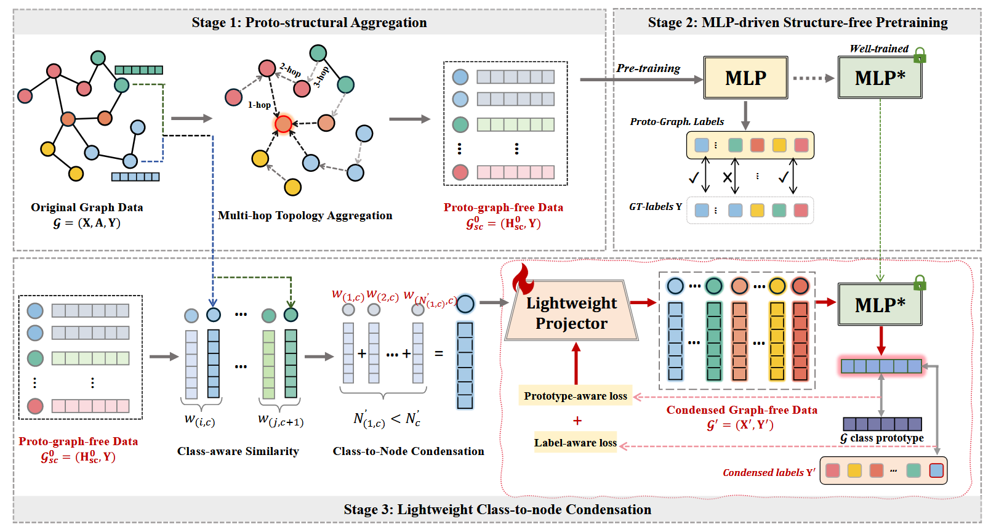

# LightGFC_
The code of paper " LIGHTWEIGHT GRAPH-FREE CONDENSATION WITH MLPDRIVEN OPTIMIZATION "

## Introduction
This repository is the implementation of 2026 ICLR paper: **LIGHTWEIGHT GRAPH-FREE CONDENSATION WITH MLPDRIVEN OPTIMIZATION**
LightGFC condenses large-scale graph data into a structure-free node set in a simple, accurate, yet highly efficient manner.
Our proposed LIGHTGFC contains three essential stages: (S1) Proto-structural aggregation (S2) MLP-driven structural-free pretraining (S3) Lightweight class-to-node condensation.

<p align="center">

</p>

## Requirements
All experiments are implemented in Python 3.9 with Pytorch 1.12.1.

```setup
conda env create -f environment.yml
```

## Condensation and Model Training

To condense the graph using LightGFC and train GCN models:
```bash
$ python main.py --gpu 0 --dataset reddit --ratio 0.001 
```
And the result of exps will be saved in `./res/`.
